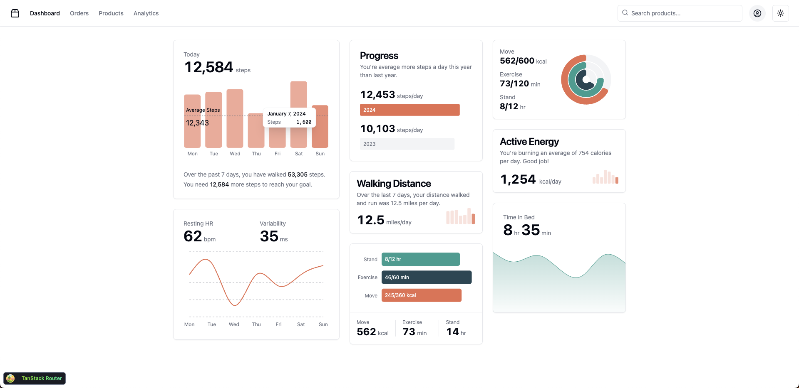
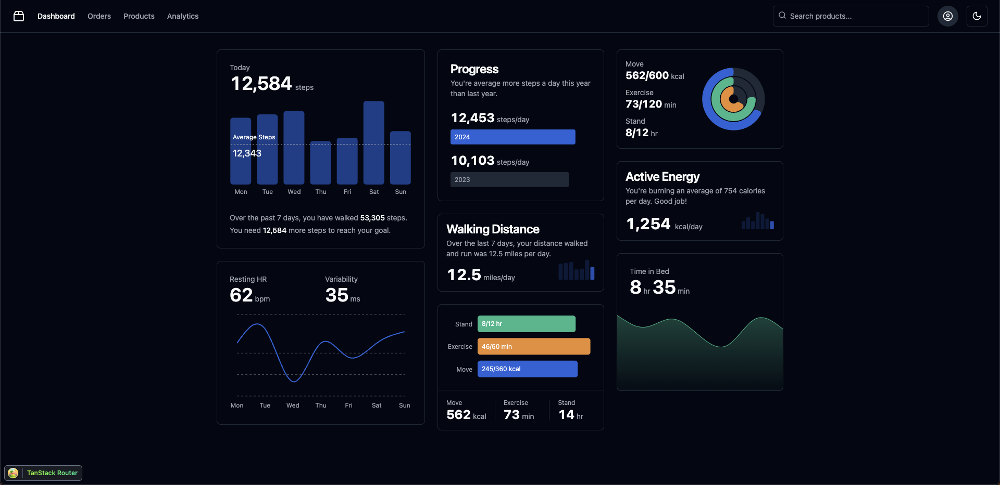
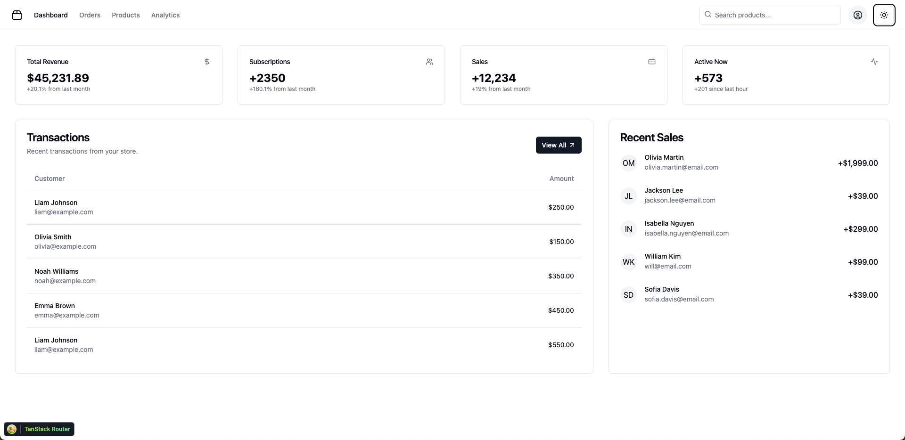
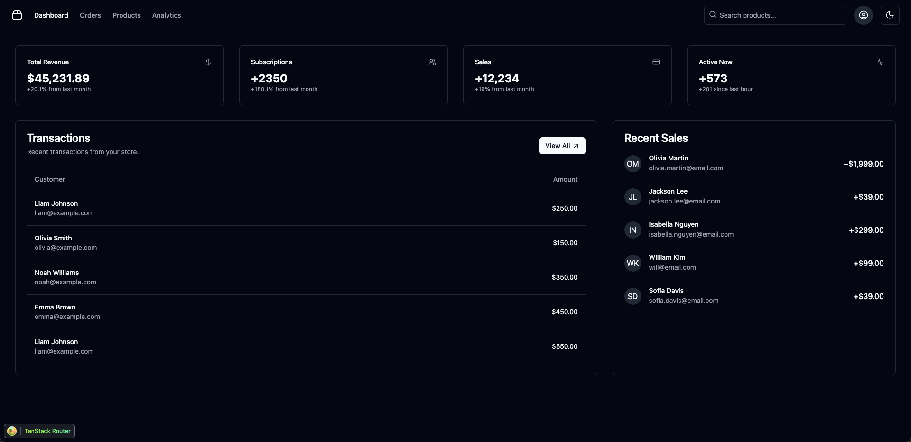
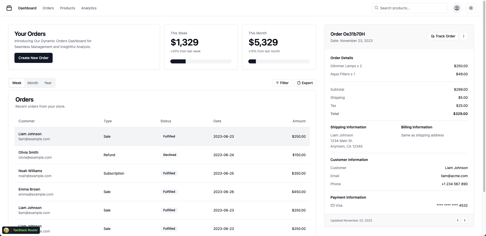
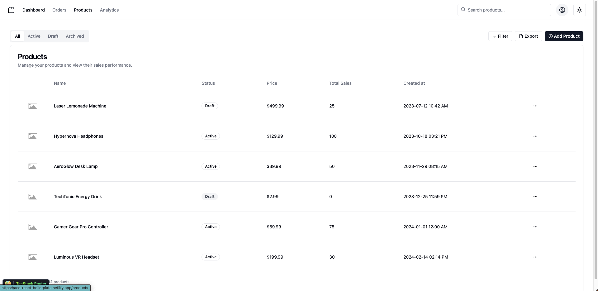

# Ace React Boilerplate 🚀
Accelerate your modern React projects with this supercharged boilerplate! 

[Live Demo](https://ace-react-boilerplate.netlify.app/)

## Packed with Power 🔋

- Rsbuild ⚡: Blazing-fast compilation. Combining Rust and TypeScript with a parallelized architecture.
- Pnpm 📦: Package management optimized for speed and efficiency.
- Tanstack Router 🗺️: A fully type-safe React router with built-in data fetching, stale-while revalidate caching and first-class search-param APIs..
- TailwindCSS ✨: Utility-first styling for rapid UI development.
- ShadcnUI 🎨: Pre-built components to kickstart your design.
- Lucid React Icons 🖼️: Beautiful icons to elevate your app's look.
- Biome.js 🌳: Format, lint, and more in a fraction of a second.
- Recharts 📊: Create stunning visualizations to tell your data's story.
- Husky & Lint Staged 👮‍♂️: Ultra-fast modern native git hooks.


## Preview














## How to setup 

Clone this repo.

Install the dependencies:

```bash
pnpm install
```

Start the dev server:

```bash
pnpm dev
```

Build the app for production:

```bash
pnpm build
```

Preview the production build locally:

```bash
pnpm preview
```
